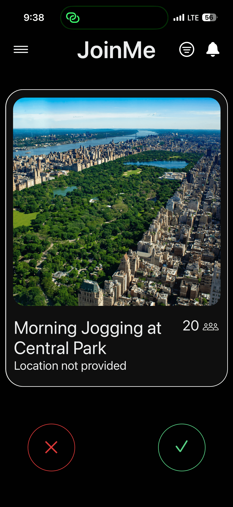
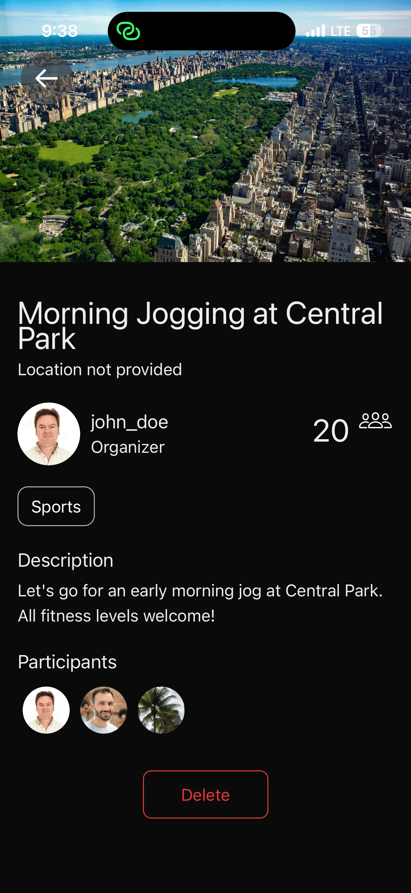
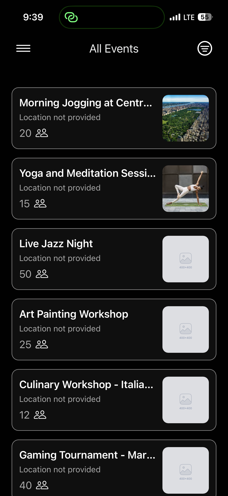
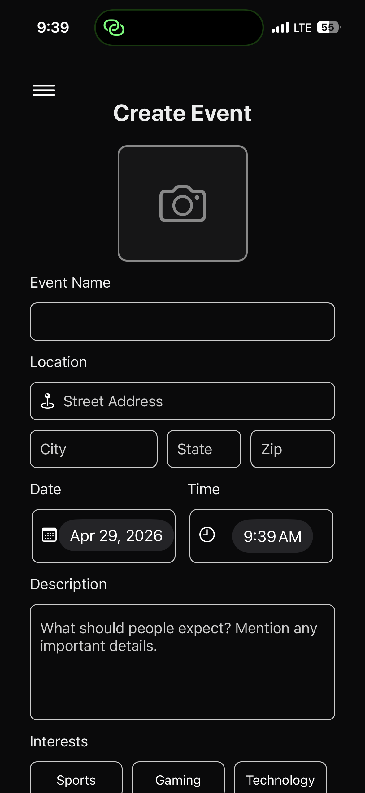
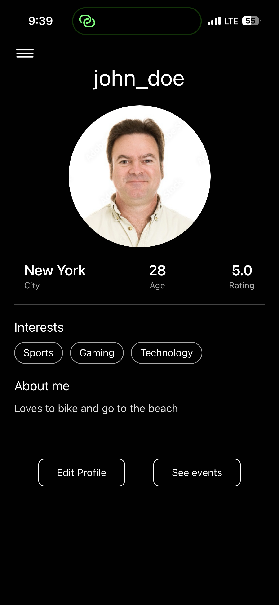
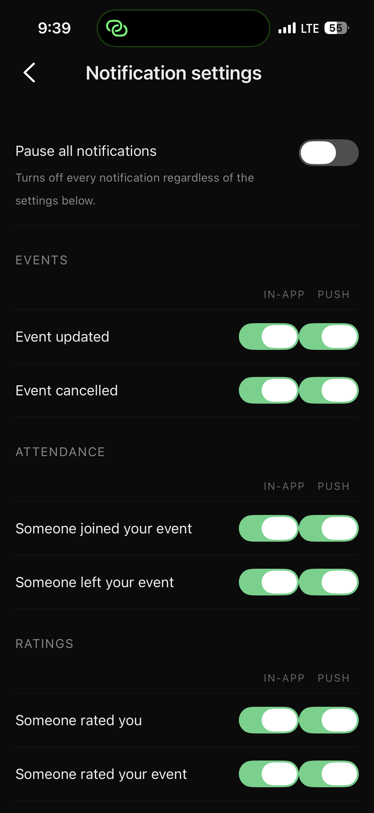

<p align="center">
  
</p>

<h1 align="center">JoinMe</h1>

<p align="center">
  <strong>Swipe. Discover. Join. — A social event discovery app.</strong>
</p>

<p align="center">
  
  
  
  
  
  
</p>

---

## About

JoinMe is a mobile app that helps you discover events happening around you — think Tinder, but for events. Swipe through event cards, create your own gatherings, and connect with people who share your interests.

## Screenshots

| Feed | Event detail | All events |
|:---:|:---:|:---:|
|  |  |  |
| **Create event** | **Profile** | **Notification settings** |
|  |  |  |

## Features

- **Swipe-based event discovery** — browse events with a pan-gesture card stack
- **Event creation & management** — create, edit, and delete your own events
- **Ratings & reputation** — rate events and other users to build community trust
- **Attendance tracking** — RSVP and confirm attendance after events
- **User profiles & preferences** — customize interests, profile photo, and location

## Tech Stack

| Layer | Technologies |
|---|---|
| **Frontend** | React Native 0.81, Expo 54, Expo Router 6, TypeScript, Zustand |
| **Backend** | Python 3.10+, FastAPI, SQLModel, MySQL (SQLite fallback for dev) |
| **Auth** | JWT (HS256) + Argon2 password hashing |
| **Storage** | Google Cloud Storage (signed URLs for images) |
| **Docs** | Docusaurus 3 |
| **CI/CD** | GitHub Actions (Docusaurus → GitHub Pages) |

## Project Structure

```
JoinMe/
├── frontend/      # React Native (Expo) mobile app
├── backend/       # Python FastAPI server
├── docs/          # Docusaurus documentation site
├── diagrams/      # Architecture & ER diagrams (Mermaid)
└── screenshots/   # Product screenshots referenced from this README
```

## Getting Started

### Prerequisites

- [Node.js](https://nodejs.org/) (LTS)
- npm
- [Python 3.10+](https://www.python.org/)
- [Expo CLI](https://docs.expo.dev/get-started/installation/)

### Backend

```bash
cd backend
python -m venv venv
source venv/bin/activate
pip install -r requirements.txt
uvicorn app.main:app --reload          # FastAPI on :8000
```

On first run the backend uses SQLite at `backend/joinme.db`. Set `DATABASE_URL` to point at MySQL if you want to run against the production-shaped DB.

### Frontend

```bash
cd frontend
npm install
npx expo start                          # Expo on :8081
```

Scan the QR code with Expo Go or run on a simulator.

### Docs (optional)

```bash
cd docs
npm install
npm run start                           # Docusaurus on :3000
```

## Documentation

Full project documentation is available at **[loganckrause.github.io/JoinMe](https://loganckrause.github.io/JoinMe/)**.
